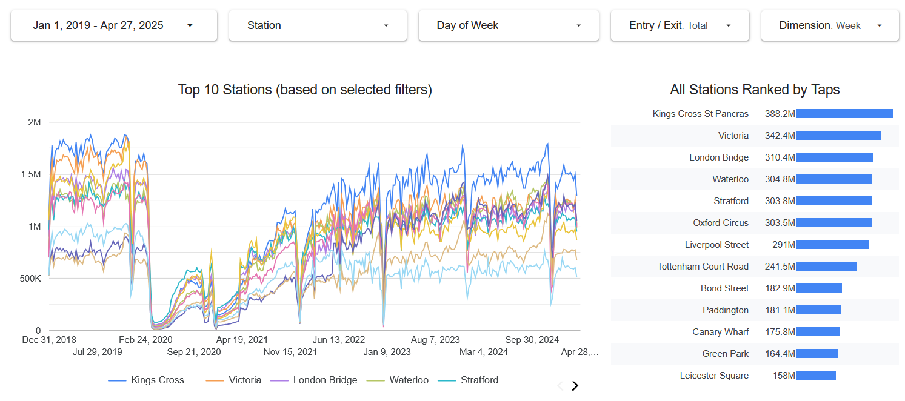

# TfL Station Footfall Data Analysis Pipeline

## Overview

This project implements an end-to-end data engineering pipeline to analyze station footfall data from Transport for London (TfL).  
The goal is to provide insights into passenger flow patterns (using tap counts of Oyster cards) at Tube and TfL Rail stations across multiple dimensions.  
Understanding these patterns is crucial for optimizing station management, improving passenger experience, identifying congestion trends, and supporting data-driven decisions for infrastructure planning and service scheduling.

The project was completed as part of the [DataTalksClub Data Engineering Zoomcamp 2025](https://github.com/DataTalksClub/data-engineering-zoomcamp).

## Technologies

- Cloud: Google Cloud Platform (GCP)

- Infrastructure as Code: Terraform

- Workflow Orchestration: Kestra

- Data Warehouse: BigQuery

- Transformation: dbt

- Visualization: Looker Studio

## How to Run

### Clone the Repository

```bash
git clone https://github.com/hbg108/tfl-data-visualization.git
cd tfl-data-visualization
```

### Set up the Service Account

Create a GCP service account with the following roles:

- `BigQuery Admin`

- `Compute Admin`

- `Storage Admin`

Create a JSON credential key for the service account. After creation, save the key. Create a folder named `.keys` under the cloned repository, upload the key into it, and rename it to `tfl.json`.

```bash
mkdir .keys
cd .keys
mv downloaded-credential-key.json tfl.json
```

### Infrastructure as Code (Terraform)

Navigate to the `terraform` directory:

```bash
cd ../terraform
vi variables.tf # update values accordingly
terraform init
terraform plan
terraform apply
```

This will create:

- A Cloud Storage bucket for raw data

- A BigQuery dataset for structured data

### Workflow Orchestration (Kestra)

Start Kestra using Docker Compose:

```bash
cd ../kestra
docker compose up -d
```

Import flows into Kestra:

```bash
curl -X POST http://localhost:8080/api/v1/flows/import -F fileUpload=@flows/01_kv.yaml
curl -X POST http://localhost:8080/api/v1/flows/import -F fileUpload=@flows/02_station_footfall.yaml
curl -X POST http://localhost:8080/api/v1/flows/import -F fileUpload=@flows/03_station_footfall_2019_2025.yaml
curl -X POST http://localhost:8080/api/v1/flows/import -F fileUpload=@flows/04_station_footfall_scheduled.yaml
curl -X POST http://localhost:8080/api/v1/flows/import -F fileUpload=@flows/05_dbt.yaml
```

Set port forwarding for port 8080 and open the Kestra UI by visiting http://localhost:8080/ in your browser.  
Edit the values in the flow `01_kv` accordingly and execute it to set the required key-value pairs in Kestra:

- `GCP_PROJECT_ID`

- `GCP_LOCATION`

- `GCP_BUCKET_NAME`

- `GCP_DATASET`

Manually add a new key-value under the `tfl` namespace, with:

- Key: `GCP_CREDS`

- Type: JSON

- Value: the contents of the `tfl.json` file downloaded when creating the service account.

### Data Ingestion

The ingestion process is automated using Kestra and follows these steps:

- Download the station footfall data from the TfL open data website (CSV format).

- Upload the data to the created Google Cloud Storage bucket.

- Create an external table for each year’s original data file (e.g., `station_footfall_2019_ext`).

- Create a table adding fields such as unique row ID and original file name, and perform data type conversions (e.g., `station_footfall_2019`).

- Create a consolidated table (`station_footfall`) merging data across all years, based on unique row IDs to avoid duplication. This table is partitioned by travel date to optimize date-based queries.

The flows are organized as follows:

- `02_station_footfall`: Defines the above ingestion process, allowing selection of specific years (2019–2024_2025).  
Due to changes in file naming conventions starting in 2023, the flow handles pre-2023 and post-2023 data differently.

- `03_station_footfall_2019_2025`: Uses `02_station_footfall` as a subflow to ingest all data from 2019 to 2024_2025.  
**It is recommended to use this flow to ingest all data in a single execution.**

- `04_station_footfall_scheduled`: Automates weekly ingestion of newly updated data from the TfL website.  
It is scheduled to run every Wednesday at 6:30 AM, slightly after the expected data update.

### Transformation (dbt)

The dbt project files are located in the `dbt` directory.  
dbt runs inside Docker via Kestra, so no manual installation of dbt is required.

The `05_dbt` flow:

- Syncs dbt project files from the Git repository.

- Creates a table `station_footfall_daily` by aggregating data from station_footfall, optimized for visualization purposes.

- Is automatically triggered upon successful completion of `04_station_footfall_scheduled`.

## Dashboard (Looker Studio)

You can access the dashboard [here](https://lookerstudio.google.com/reporting/33cf406c-c312-4a59-bebd-5d8bf62e0ca6).

The dashboard includes two tiles and allows users to filter by:

- Date Range

- Station

- Day of Week

- Tap Type (Entry / Exit / Total)

- Granularity (Day / Week / Month / Year)

### Tiles

- **Time Series Chart**

  Displays tap counts over time for the top 10 stations.

- **Station Ranking Table**

  Lists all stations ranked by tap counts.



## Notes

- Data source: https://crowding.data.tfl.gov.uk/

- Official dashboards are available at the [TfL Network Demand Data site](https://tfl.gov.uk/corporate/publications-and-reports/network-demand-data).

- This project independently builds a full data pipeline and custom dashboard for learning and exploration purposes.